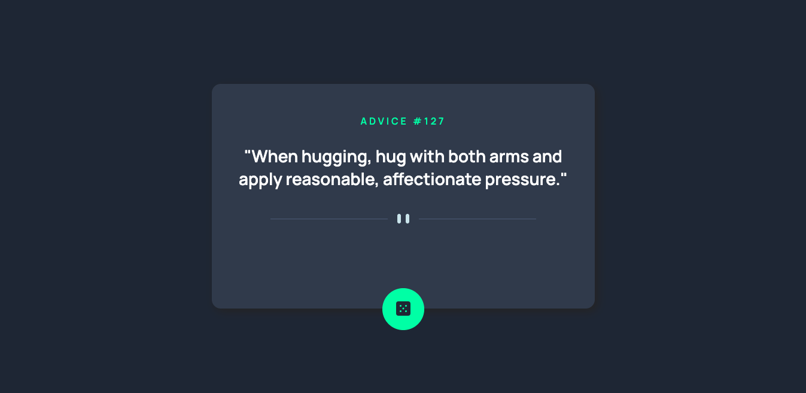

# Frontend Mentor - Advice generator app solution

This is a solution to the [Advice generator app challenge on Frontend Mentor](https://www.frontendmentor.io/challenges/advice-generator-app-QdUG-13db). Frontend Mentor challenges help you improve your coding skills by building realistic projects.

## Table of contents

- [Overview](#overview)
  - [The challenge](#the-challenge)
  - [Screenshot](#screenshot)
  - [Links](#links)
- [My process](#my-process)
  - [Built with](#built-with)
  - [What I learned](#what-i-learned)
  - [Continued development](#continued-development)
  - [Useful resources](#useful-resources)
- [Author](#author)


**Note: Delete this note and update the table of contents based on what sections you keep.**

## Overview

### The challenge

Users should be able to:

- View the optimal layout for the app depending on their device's screen size
- See hover states for all interactive elements on the page
- Generate a new piece of advice by clicking the dice icon

### Screenshot




### Links

- Solution URL: [https://github.com/fmanjencic/Advice-Generator-App]

## My process

### Built with

- Semantic HTML5 markup
- CSS custom properties
- Flexbox
- Mobile-first workflow

**Note: These are just examples. Delete this note and replace the list above with your own choices**

### What I learned

This challenge was useful for honing my CSS skills by attempting to match a provided design. In addition, I implemented code that consumed an API that returned JSON data into my project. 


```js
async function getQuote() {
    const url = `https://api.adviceslip.com/advice`;
    fetch(url)
        .then(response => response.json())
        .then(data => {
            console.log(data)
            mainQuote[0] . textContent = `"${data.slip.advice}"`;
            adviceHeader[0].textContent = `ADVICE #${data.slip.id}`;
        })
}
```


### Continued development

This challenge was useful for honing my CSS skills by attempting to match a provided design. Projects similar to this one with varying levels of complexity will help to optimize my front-end development skillset. 

### Useful resources

- [www.w3schools.com] - This proved to be a useful resource for syntax and a reference for CSS and JavaScript. 

## Author

- Frontend Mentor - [@fmanjencic]


